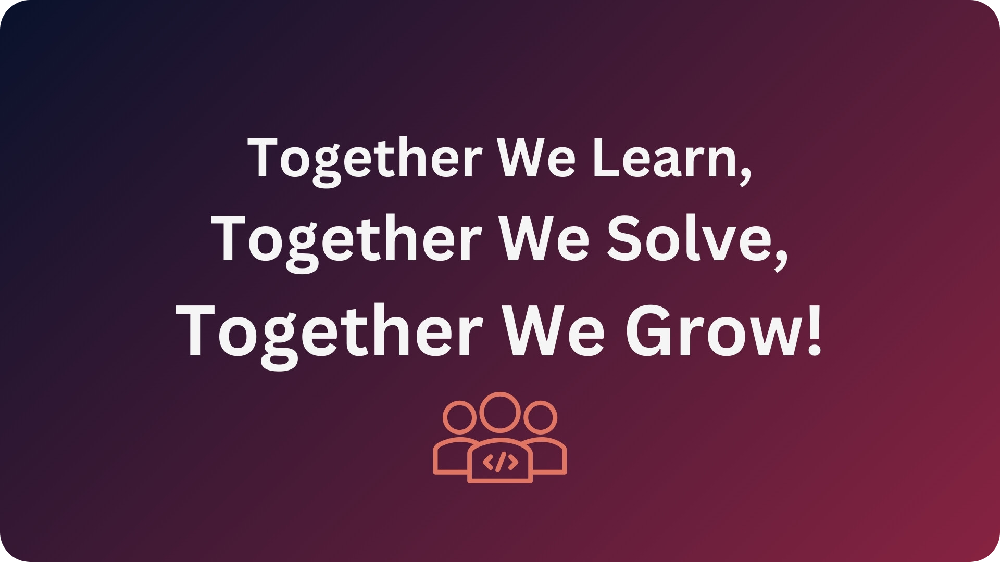

# ITI Full Stack .Net Training Journey

## Introduction

This repository contains my journey through the Full Stack .Net Training at ITI. It contains all my notes, tasks and projects that I have worked on during the training.

## Index

This index will be updated as I progress through the training. It will contain all the topics that we have covered in the training. and links to the related notes, tasks and projects.

### Index Navigation Guide

- [Client Side Technologies (CST)](#client-side-technologies-cst)
  - [Intro To Web Development, HTML4, CSS2.0](#intro-to-web-development-html4-css20)
  - [JavaScript 5, ECMA5](#javascript-5-ecma5)
  - [JavaScript 6, ECMA6](#javascript-6-ecma6)
  - [HTML5, CSS3.0](#html5-css30)
- [C# Programming Language](#c-programming-language)
  - [C# OOP](#c-oop)
  - [C# Basics](#c-basics)
- [Database (SQL Server)](#database-sql-server)
- [Entity Framework Core (`EF Core`)](#entity-framework-core-ef-core)
- [ASP .NET MVC](#asp-net-mvc)
- [ASP .NET Web API](#asp-net-web-api)

**_[TOP⬆](#iti-full-stack-net-training-journey)_**

### Client Side Technologies (CST)

#### Intro To Web Development, HTML4, CSS2.0

| Lecture                                                | Topics Covered                                                                                                                                                                                                                                                                          | Notes                                                                             |
| ------------------------------------------------------ | --------------------------------------------------------------------------------------------------------------------------------------------------------------------------------------------------------------------------------------------------------------------------------------- | --------------------------------------------------------------------------------- |
| 🔖 ITI - D0001 - Client Server Model & Basics of HTML4 | • Client Server Model (Request, Response) • Frontend Technologies • HTML                                                                                                                                                                                                        | [Markdown](./notes/markdown/iti-d0001-client-server-model-and-basics-of-html4.md) |
| 🔖 ITI - D0002 - CST (HTML Part2)                      | • Tables in HTML • Form                                                                                                                                                                                                                                                             | [Markdown](./notes//markdown/iti-d0002-cst-html-part2.md)                         |
| 🔖 ITI - D0003 - CST (CSS 2.0)                         | • Introduction • HTML Problems with Styles • CSS Usage • CSS Comments • CSS Selectors • Box Model • Styling Text • Display (block, inline-block, block) • Styling Lists • Styling Images • Styling Background • Position • Float Layout | [Markdown](./notes/markdown/iti-d0003-cst-css2.md)                                |

**_[TOP⬆](#iti-full-stack-net-training-journey)_**

#### JavaScript 5, ECMA5

| Lecture                                             | Topics Covered                                                                                                                                                   | Notes                                                                |
| --------------------------------------------------- | ---------------------------------------------------------------------------------------------------------------------------------------------------------------- | -------------------------------------------------------------------- |
| 🔖 ITI - D0004 - CST (JavaScript 5, ECMA5)          | • JavaScript • How to use JS with HTML • Dealing with not-allowed JS on Browsers • Variables and Datatypes • Dialog • Write on HTML document | [Markdown](./notes/markdown/iti-d0004-cst-javascript-ecma5.md)       |
| 🔖 ITI - D0005 - CST (JavaScript 5, ECMA5) (Part 2) | • Strings • Arrays                                                                                                                                           | [Markdown](./notes/markdown/iti-d0005-cst-javascript-ecma5-part2.md) |
| 🔖 ITI - D0006 - CST (JavaScript 5, ECMA5) (Part 3) | • Functions • Boolean • Date • Math                                                                                                                  | [Markdown](./notes/markdown/iti-d0006-cst-javascript-ecma5-part3.md) |
| 🔖 ITI - D0007 - CST (JavaScript 5, ECMA5) (Part 4) | • BOM (Browser Object Model) • DOM (Document Object Model)                                                                                                   | [Markdown](./notes/markdown/iti-d0007-cst-javascript-ecma5-part4.md) |
| 🔖 ITI - D0008 - CST (JavaScript 5, ECMA5) (Part 5) | • document.cookie • Events • Regex                                                                                                                       | [Markdown](./notes/markdown/iti-d0008-cst-javascript-ecma5-part5.md) |

**_[TOP⬆](#iti-full-stack-net-training-journey)_**

#### JavaScript 6, ECMA6

| Lecture                                                        | Topics Covered                                                                                                                                    | Notes                                                                |
| -------------------------------------------------------------- | ------------------------------------------------------------------------------------------------------------------------------------------------- | -------------------------------------------------------------------- |
| 🔖 ITI - D0009 - CST (JavaScript 6, ECMA6, ECMA.NEXT) (Part 1) | • ECMA6 • Block Scoping using (`let`, `const`) • String Updates: String literals using (``): string interpolation • Function Updates  | [Markdown](./notes/markdown/iti-d0009-cst-javascript-ecma6-part1.md) |
| 🔖 ITI - D0010 - CST (JavaScript 6, ECMA6, ECMA.NEXT) (Part 2) | • Classes • OOP • JS Modules                                                                                                              | [Markdown](./notes/markdown/iti-d0010-cst-javascript-ecma6-part2.md) |
| 🔖 ITI - D0011 - CST (JavaScript 6, ECMA6, ECMA.NEXT) (Part 3) | • Asynchronous • JS Runtime Environment • JS Engine • Promises • async/await • fetch API • Web Storage API • JSON API | [Markdown](./notes/markdown/iti-d0011-cst-javascript-ecma6-part3.md) |

**_[TOP⬆](#iti-full-stack-net-training-journey)_**

#### HTML5, CSS3.0

| Lecture                              | Topics Covered                                                                                                                                                                  | Notes                                                     |
| ------------------------------------ | ------------------------------------------------------------------------------------------------------------------------------------------------------------------------------- | --------------------------------------------------------- |
| 🔖 ITI - D0011 - CST (HTML5)         | • Semantic Tags • CSS 3.0 • JS APIs • New CSS Selectors • MediaQuery • XML • XHTML                                                                      | [Markdown](./notes/markdown/iti-d0011-cst-html5.md)       |
| 🔖 ITI - D0012 - CST (HTML5) (Part2) | • Shadows • Manipulating section text • Transformation • Transitions • Animation • CSS Variables • Box Sizing • Measure Units • Flex • Grid | [Markdown](./notes/markdown/iti-d0012-cst-html5-part2.md) |
| 🔖 ITI - D0013 - CST (HTML5) (Part3) | • New Added APIs • Media APIs • Drag And Drop • Forms • Storage API • Geolocation API                                                                       | [Markdown](./notes/markdown/iti-d0013-cst-html5-part3.md) |

**_[TOP⬆](#iti-full-stack-net-training-journey)_**

### C# Programming Language

#### C# OOP

| Lecture                                | Topics Covered                                                                                                              | Notes                                                      |
| -------------------------------------- | --------------------------------------------------------------------------------------------------------------------------- | ---------------------------------------------------------- |
| 🔖 ITI - D0015 - C Sharp - OOP         | • Programming Paradigms • `C#` • OOP • Namespace in CS • DataTypes in CS                                    | [Markdown](./notes/markdown/iti-d0015-csharp-oop.md)       |
| 🔖 ITI - D0016 - C Sharp - OOP (Part2) | • Parsing • Read Input From Console • Clear Console • Control Flow In C# • Arrays • Functions (Methods) | [Markdown](./notes/markdown/iti-d0016-csharp-oop-part2.md) |
| 🔖 ITI - D0017 - C Sharp - OOP (Part3) | • Difference between Value Type and Reference Types • Structures                                                        | [Markdown](./notes/markdown/iti-d0017-csharp-oop-part3.md) |
| 🔖 ITI - D0018 - C Sharp - OOP (Part4) | • Class Constructor • Properties • Object Initializers • Finalizers (Destructors) • Array of Objects        | [Markdown](./notes/markdown/iti-d0018-csharp-oop-part4.md) |
| 🔖 ITI - D0019 - C Sharp - OOP (Part5) | • Automatic Properties • OOP Pillar: Inheritance • Virtuality and Method Resolution                                 | [Markdown](./notes/markdown/iti-d0019-csharp-oop-part5.md) |
| 🔖 ITI - D0020 - C Sharp - OOP (Part6) | • Abstract Class • `static` Class & `static` Class Members • Operator Overloading • Access Modifiers            | [Markdown](./notes/markdown/iti-d0020-csharp-oop-part6.md) |

**_[TOP⬆](#iti-full-stack-net-training-journey)_**

#### C# Basics

| Lecture                                   | Topics Covered                                                                                                                                                                                                                                                                                                                                                                                                                                                        | Notes                                                                       |
| ----------------------------------------- | --------------------------------------------------------------------------------------------------------------------------------------------------------------------------------------------------------------------------------------------------------------------------------------------------------------------------------------------------------------------------------------------------------------------------------------------------------------------- | --------------------------------------------------------------------------- |
| 🔖 ITI - D0021 - C Sharp - Basics         | • History before C# • C# History • Compilation of C# Code • Running C# Code • Cross-Language Platform • .NET Core • GAC (Global Assembly Cache)                                                                                                                                                                                                                                                                                               | [Markdown](./notes/markdown/iti-d0021-csharp-basics.md)                     |
| 🔖 ITI - D0022 - C Sharp - Basics (Part2) | • Object Base `Object` • Casting & Parsing • Enums                                                                                                                                                                                                                                                                                                                                                                                                            | [Markdown](./notes/markdown/iti-d0022-csharp-basics-part2.md)               |
| 🔖 ITI - D0023 - C Sharp - Basics (Part3) | • Bitwise Operators • Enums & Bit Flag Enumerations                                                                                                                                                                                                                                                                                                                                                                                                               | [Markdown](./notes/markdown/iti-d0023-csharp-basics-part3.md)               |
| 🔖 ITI - D0024 - C Sharp - Basics (Part4) | • Enums (Bit Flag) • Nullable Variables in C# • Advanced Array Topics in C# • Pass by Value vs. Pass by Reference in C# • Difference Between `ref` and `out` • `params` Keyword • Default and Optional Parameters in C#                                                                                                                                                                                                                       | [Markdown](./notes/markdown/iti-d0024-csharp-basics-part4.md)               |
| 🔖 ITI - D0025 - C Sharp - Basics (Part5) | • Structures (Enhancements in C#9.0+) • Target-Typed new Expressions • Interfaces • Design Pattern: Singleton • Switch Expression in `C#` • `in` keyword and return `ref` • `StreamWriter` • Exception • `var` vs. `dynamic` vs. `object` • Mutability (Mutable data-types vs Immutable data-types) • String Builder • `init` Accessors in Properties • `record` Types in `C#` • Extension Methods • XML Docs | [Markdown](./notes/markdown/iti-d0025-csharp-basics-part5.md)               |
| 🔖 ITI - D0026 - C Sharp - Basics (Part6) | • `is` and `as` Operators • Collections • Built-in Generics • User Defined Generics • Delegates                                                                                                                                                                                                                                                                                                                                                       | [Markdown](./notes/markdown/iti-d0026-csharp-basics-part6.md)               |
| 🔖 ITI - D0027 - C Sharp - Basics (Part7) | • Events • Partial Classes • Intro to WindowsForms                                                                                                                                                                                                                                                                                                                                                                                                            | [Markdown](./notes/markdown/iti-d0027-csharp-basics-part7.md) `In Progress` |

**_[TOP⬆](#iti-full-stack-net-training-journey)_**

### Database (SQL Server)

| Lecture                   | Topics Covered                                                                                                                                                                                                                                                   | Notes                                              |
| ------------------------- | ---------------------------------------------------------------------------------------------------------------------------------------------------------------------------------------------------------------------------------------------------------------- | -------------------------------------------------- |
| 🔖 ITI - D0029 - Database | • Database Life Cycle • File Based System • Database Basic Definitions • Benefits of Database System • Database Users • Entity-Relationship Model (ER Model) • Types of Keys                                                             | [Markdown](./notes/markdown/iti-d0029-database.md) |
| 🔖 ITI - D0030 - Database | • Primary Key vs. Foreign Key • ER-to-Relational Mapping • SQL (Structured Query Language) • Microsoft SQL Server • DQL - Data Query Language • DML - Data Manipulation Language • DDL - Data Definition Language                        | [Markdown](./notes/markdown/iti-d0030-database.md) |
| 🔖 ITI - D0031 - Database | • Types of Joins in SQL Server • JOINs with DML Statements • Actions For Referential Integrity • Handling `NULL` Values in Queries • Identity Column • Database Integrity                                                                    | [Markdown](./notes/markdown/iti-d0031-database.md) |
| 🔖 ITI - D0032 - Database | • Aggregate Functions • Grouping • Query Execution Order • Subquery • Set Operations • Data Types In MS SQL Server • Using Column Numbers in `ORDER BY` • `LIKE` operator with `WHERE` clause • BATCH vs. Script vs. Transaction | [Markdown](./notes/markdown/iti-d0032-database.md) |
| 🔖 ITI - D0033 - Database | • Database Security in MS SQL Sever • Synonyms in MS SQL Server • Using Full Path in MS SQL Server • T-SQL (Transact SQL)                                                                                                                            | [Markdown](./notes/markdown/iti-d0033-database.md) |
| 🔖 ITI - D0034 - Database | • Variables in MS SQL Server • SYS Schema in MS SQL Server • Control Flow Statements in MS SQL Server • Windowing Functions in MS SQL Server • Functions in MS SQL Server                                                                        | [Markdown](./notes/markdown/iti-d0034-database.md) |
| 🔖 ITI - D0035 - Database | • Indexes in MS SQL Server • Cursors in MS SQL Server • Advanced Grouping & Pivoting in MS SQL Server • Views in MS SQL Server • Backups in MS SQL Server • Jobs in MS SQL Server                                                            | [Markdown](./notes/markdown/iti-d0035-database.md) |
| 🔖 ITI - D0036 - Database | • How SQL Server Engine Handles a Query • Stored Procedures • Triggers • Backups in MS SQL Server                                                                                                                                                    | [Markdown](./notes/markdown/iti-d0036-database.md) |

**_[TOP⬆](#iti-full-stack-net-training-journey)_**

### Entity Framework Core (`EF Core`)

| Lecture                           | Topics Covered                                                                                                                                                                                                                                                                                                                                                                                                                                                                                                                                                                                                                                                           | Notes                                        |
| --------------------------------- | ------------------------------------------------------------------------------------------------------------------------------------------------------------------------------------------------------------------------------------------------------------------------------------------------------------------------------------------------------------------------------------------------------------------------------------------------------------------------------------------------------------------------------------------------------------------------------------------------------------------------------------------------------------------------ | -------------------------------------------- |
| 🔖 ITI - D0039 - Entity Framework | • Overview • EF Core Installation for SQL Server • Development Approaches in EF Core • Code First Approach Workflow • Add Constrains on Entity Properties • Navigation Properties • Creational Strategies in EF Core • Inheritance Mapping • Loading Strategies of Related Data in EF Core • DbContext is a Disposable Object • Tracking and No-Tracking Queries in EF Core • Access SQLQuery Generated via EF Core • Server vs. Client Query Processing in EF Core • Write Raw SQL Queries in EF Core • Organizing Entity Configurations with Fluent API in Separate Classes • Practical Example of EF Core | [Markdown](./notes/markdown/iti-d0039-ef.md) |

**_[TOP⬆](#iti-full-stack-net-training-journey)_**

### ASP .NET MVC

| Lecture                       | Topics Covered                                                                                                                                                                                                             | Notes                                             |
| ----------------------------- | -------------------------------------------------------------------------------------------------------------------------------------------------------------------------------------------------------------------------- | ------------------------------------------------- |
| 🔖 ITI - D0040 - ASP .NET MVC | • Overview • Client Server Model • HTTP • ASP .NET MVC Components • Bind Data to View • Access Request Data in Controller Action • Write CSharp Code in View                                       | [Markdown](./notes/markdown/iti-d0040-asp-mvc.md) |
| 🔖 ITI - D0041 - ASP .NET MVC | • Returned Types from Controller Actions • EF Core With ASP .NET MVC • Controller Action Route Patterns • Map Action to Specific HTTP Methods (Action Selector) • ASP Tag Helpers                          | [Markdown](./notes/markdown/iti-d0041-asp-mvc.md) |
| 🔖 ITI - D0042 - ASP .NET MVC | • Annotations With Controller Actions • ASP Tag Helpers with Form and Hidden Fields • ASP Validation                                                                                                               | [Markdown](./notes/markdown/iti-d0042-asp-mvc.md) |
| 🔖 ITI - D0043 - ASP .NET MVC | • Modularize MVC Application Into Layers • Dependency Injection • How to Apply DI in ASP .NET MVC                                                                                                                  | [Markdown](./notes/markdown/iti-d0043-asp-mvc.md) |
| 🔖 ITI - D0044 - ASP .NET MVC | • Action Filters in ASP.NET MVC • Middleware in ASP.NET Core • Layouts in ASP.NET Core • Partial Views in ASP.NET Core • View Imports in ASP.NET Core • Scaffolded Controllers & Views in ASP.NET Core | [Markdown](./notes/markdown/iti-d0044-asp-mvc.md) |
| 🔖 ITI - D0045 - ASP .NET MVC | • HTTP Request State Management in ASP .NET MVC • Authentication and Authorization in ASP .NET MVC • Display Model Errors in Razor View                                                                            | [Markdown](./notes/markdown/iti-d0045-asp-mvc.md) |
| 🔖 ITI - D0046 - ASP .NET MVC | • Razor Pages • How to Structure a Razor Pages Project • Generic Repository Pattern                                                                                                                                | [Markdown](./notes/markdown/iti-d0046-asp-mvc.md) |

**_[TOP⬆](#iti-full-stack-net-training-journey)_**

### ASP .NET Web API

| Lecture                       | Topics Covered                                                                                                                                                                                                                                                                                            | Notes                                             |
| ----------------------------- | --------------------------------------------------------------------------------------------------------------------------------------------------------------------------------------------------------------------------------------------------------------------------------------------------------- | ------------------------------------------------- |
| 🔖 ITI - D0047 - ASP .NET API | • Overview • REST APIs • Intro to ASP .NET Web API • Controllers in ASP .NET Web API • Route Templates in ASP .NET Web API • Validation in ASP .NET Web API • API Controller Example in ASP .NET Web API • OpenAPI Documentation in ASP .NET Web API • C Sharp API Client | [Markdown](./notes/markdown/iti-d0047-asp-api.md) |
| 🔖 ITI - D0048 - ASP .NET API | • JsonIgnore • ASP.NET Core Attributes for Web API Controllers • Binding Source Parameter Inference in ASP.NET Core • DTOs (Data Transfer Objects) • AutoMapper • Web API Pagination • CORS (Cross-Origin Resource Sharing)                                                       | [Markdown](./notes/markdown/iti-d0048-asp-api.md) |

**_[TOP⬆](#iti-full-stack-net-training-journey)_**

## Side Activities

- [Problem Solving](./side-activities/problem-solving/README.md)

## Progress

- [ ] Add notes for all topics as a Markdown files.
- [ ] Add notes for all topics as a PDF files.
- [ ] Automate the process of converting the Markdown files to PDF files.
- [ ] Add tasks for all topics

**_[TOP⬆](#iti-full-stack-net-training-journey)_**

## Disclaimer

This repository is contains my personal notes and work. It is not an official repository for ITI. It is not affiliated with ITI in any way. It is just a personal repository that I am using to document my journey through the training.

So, if you are looking for official resources, please refer to the official ITI resources.

Also, if you find any mistakes in the notes or tasks, please feel free to open an issue or a pull request to correct it, I will be happy to receive your feedback!🙌

**_[TOP⬆](#iti-full-stack-net-training-journey)_**

## Contributions

I will be happy to receive any contributions from anyone who is interested in this repository. You can contribute by adding more notes, tasks or projects that you think will be helpful for others.

**_[TOP⬆](#iti-full-stack-net-training-journey)_**

## License

This repository is licensed under the MIT License - see the [LICENSE](LICENSE) file for details.

**_[TOP⬆](#iti-full-stack-net-training-journey)_**
