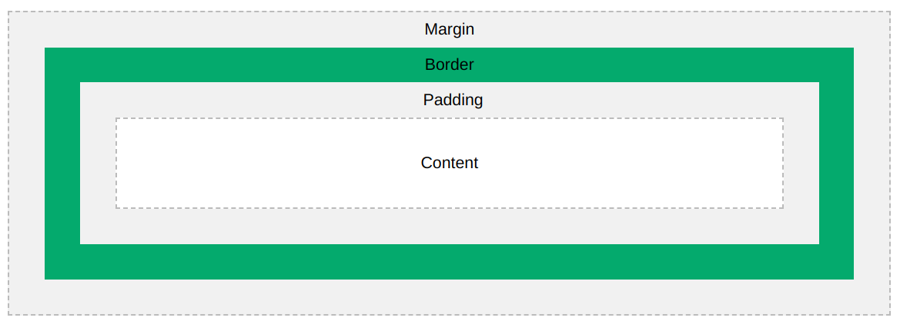

# 🔖 ITI - D0003 - CST (CSS 2.0)

## Introduction

- CSS stands for Cascaded Style Sheet
- Used to style HTML Pages

## HTML Problems with Styles

- Mixing HTML elements with styles
- Redundancy
- Maintainability
- Reusability

> [!Tip] Solution
> Use External Style Sheet

## CSS Usage

- Inline CSS (_using:_ `style="property:value;..."` attribute)
- Internal CSS (_using:_ `<style>...</style>`)
- External Sheet (_using:_ `<link rel="stylesheet" href="style_sheet_name.css"/>`)

> [!Note]
>
> - Later styles in the same scope override earlier ones.
> - External stylesheets are overridden by internal styles and inline styles (unless marked `!important`).

## CSS Comments

```css
/* your comment*/
```

## CSS Selectors

> [!Info]
> "Select something to do something"
> Will be used by jQuery, JavaScript, CSS

### Basic Selectors

- **Tag Name**
- **ID**
- **Class**
- **Pseudo Element**
- **Pseudo Class**
- **Attribute**
- **Universal** (`*`)
- **Group** (you can group any type of selectors with each other using `,`)
- **Descending** (space)
- **Direct Child** (`>`)

#### ID

- Selected by `#id`
- Id must be unique per HTML document

#### Class

- Selected by `.class-name`

#### Attribute

- Selected by `[attribute=value]`
- You can use regex with attribute value like (`^=` (starts with), `$=` (ends with), `*=` (contains).)

```css
input[type="text"] {
  width: 100%;
}
```

#### Pseudo Class

- Interactive Selectors
- The **order** of these pseudo classes is **important**:
- `:hover` – Used for hover effects.
- `:focus` – Style elements when focused (like form inputs).
- `:active` – Style elements when clicked.
- `:visited` – Style visited links.

#### Group

- You can group any type of selectors with each others using `,`

```css
h1,
h2,
h3,
.heading {
  color: red;
}
```

> [!Note]
> Also we can group elements inside `div` element

### Selectors Specificity

- Each selector has a weight
- If there are 2 or more CSS rules point to the same element, the selector with heights specificity will win
- Selectors priority from highest to lowest is:
  1.  Declarations marked `!important`
  2.  Inline style
  3.  ID selector
  4.  Class selector
  5.  Element selector
  6.  Universal selector

## Box Model

- Margin (top, right, bottom, left)
- Padding (top, right, bottom, left)
- Border (top, right, bottom, left) (border-in, border-out)
- Width
- Height



### Borders and Border radius

```css
p {
  border: 2px solid red;
  border-radius: 5px;
}
```

## Styling Text

- `color`
- `background-color`
- `border`
- `text-align`
- `word-spacing`
- `letter-spacing`
- `font-size`
- `font-weight`
- `font-style`
- `font-family`
- `font`

> [!Note] >`<span></span>` is an inline element, mostly used to style some part of text.

## Display (block, inline-block, block)

- **`block`** elements have
  - Takes full width of their container by default
  - Enforces Line break
  - Padding (top, bottom, right, left)
  - Margin (top, bottom, right, left)
  - Width
  - Height
- **`inline`**
  - Padding (left, right)
  - Margin (left, right)
- **`inline-block`**
  - Width
  - Height
  - Padding (top, bottom, left, right)
  - Margin (top, bottom, left, right)

## Styling Lists

- `list-style`
- `list-style-type`
- `display`
- `opacity`

## Styling Images

- `width`
- `height`
- `border`
- `opacity`

## Styling Background

- `background-color`
- `background-image`
- `background-repeat`
- `background-attachment`
- `background-position`

## Position

- **static** (default position) (top, right, left, bottom values not applied)
- **fixed** (top, right, left, bottom values calculated relatively to **body element**)
- **relative** (top, right, left, bottom values, is calculated relatively to **its old position**)
- **absolute** (top, right, left, bottom values, is calculated relatively to **its first relative parent** or from **body**)

> [!INFO] Negative spacing
>
> - Refers to default padding and margin
> - Solve it by normalizing CSS sheet at the beginning

## Float Layout

The `float` property is used for positioning and formatting content e.g. let an image float left to the text in a container.

The `float` property can have one of the following values:

- `left` - The element floats to the left of its container
- `right` - The element floats to the right of its container
- `none` - The element does not float (will be displayed just where it occurs in the text). This is default
- `inherit` - The element inherits the float value of its parent

```css
img {
  float: right;
}
```

> [!Note]
> When we use the `float` property, and we want the next element below (not on right or left), we will have to use the `clear` property.
>
> ```css
> .clear-float {
>   clear: both;
> }
> ```

_**[Back to the Index](../../README.md#index)**_
