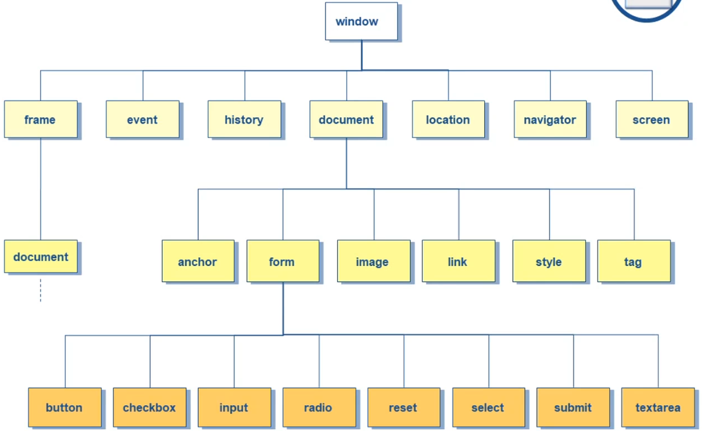

# 🔖 ITI - D0007 - CST (JavaScript 5, ECMA5) (Part 4)

## BOM (Browser Object Model)

- Consists of the objects `navigator`, `history`, `screen`, `location` and `document` which are children of `window`
  
- **`window`**: the top-level object; has properties that apply on the entire window.
- **`navigator`**: has properties related to the name and version fo the navigator (browser) being used.
- **`document`**: contains properties based on the content of the document, such as title, background color, links, and forms.
- **`location`**: has properties based on the current URL.
- **`history`**: contains properties representing URLs the client has previously requested.
- **`screen`**: contains information about the visitor's screen.

### `window` Object

#### `window` Common properties

- **`innerHeight`** the inner height of a window's area
- **`innerWidth`** the inner width of a window content area
- **`outerHeight`** the outer height of a window, including toolbars/scrollbars
- **`outerWidth`** the outer width of a window, including toolbars/scrollbars
- **`screenLeft = screenX`** the horizontal coordinate of the window relative to the screen
- **`screenTop = screenY`** the vertical coordinate of the window relative to the screen
- **`pageXOffset = scrollX`** the pixels the current document has been scrolled (horizontally) from upper left corner of the window
- **`pageYOffset = scrollY`** the pixels the current document has been scrolled (vertically) from the upper left corner of the window
- **`document`** reference to the current document object
- **`frames`** an array referencing all the frames in the current window
- **`frameElement`** returns the `<iframe>` element in which the current window is inserted
- **`history`** reference to the history object of JS
- **`navigator`** reference to the browser application
- **`location`** reference to the location object of JS

> [!Tip]
> Checking if the page is fully scrolled
>
> ```js
> function isFullyScrolled(pageWindow) {
>   return (
>     pageWindow.scrollY + pageWindow.innerHeight >=
>     pageWindow.document.body.scrollHeight
>   );
> }
> console.log(isFullyScrolled(window));
> ```

> [!Note]
> Any global variable or function will be accessible by `window` object

#### `window` common methods

- **`alert(message)`** displays an alert box with message and an OK button
- **`confirm(message)`** displays a dialog box with a message and an OK, returning true, and a Cancel, returning false
- **`prompt(message)`** displays a dialog box that prompts the user for input
- **`open()`** opens a new browser window
- **`close()`** close a specified window
- **`focus()`** sets focus to the current window
- **`blur()`** removes focus from the current window
- **`getSelection()`** returns a selection object representing the range of text selected by the user
- **`stop()`** stops the window from loading
- **`print()`** print the contents of the specified window
- **`moveTo(h,v)`** moves the window to the horizontal and vertical position relative top-left of screen
- **`moveBy(h,v)`** moves the window by + or - horizontal and vertical pixels
- **`resizeTo(h,v)`** changes the size of the window to horizontal and vertical number of pixels
- **`resizeBy(h,v)`** changes the size of the window by + or - horizontal and vertical pixels
- **`scrollTo(h,v)`** scrolls the document in the current window or frame to horizontal and vertical pixel positions from top of document
- **`scrollBy(h,v)`** scrolls the document in the current window or frame by + or - horizontal and vertical pixel from current position
- **`setInterval(function, interval_in_ms)`** evaluates an expression at specified intervals
- **`clearInterval(interval_id)`** used to clear a time interval set using returned value from the above method
- **`setTimeout(function, timeout_in_ms)`** used to execute an expression or function after a time interval(in $ms$)
- **`clearTimeout(timer_id)`** used to clear a timeout set using the returned number from the above method

**Example: Open and close window**:

```js
open(url, target, features);

// example
const targetWindow = open("./doc1.html", "", "width=200,height=200");
targetWindow.close();
conosle.log(targetWindow.opener); // will access parent window
```

**Example: move window**:

```js
moveTo(100, 200);
moveBy(50, 0);
```

#### `window.screen`

- The screen object provides information about the desktop outside the browser
- This object allows scripts to:
  - detect the browsers's usable area
  - return information on the display screen's dimensions and color depth, etc..
- **Properties**:
  - `avilHeight`: returns the height of the screen (excluding the windows' taskbar)
  - `availWidth`: returns the width of the screen (excluding the windows' taskbar)
  - `colorDepth`: returns the bit depth of the color palette for displaying images
  - `height`: returns the total height of the screen
  - `pixelDepth`: returns the color resolution (in bits per pixel) of the screen
  - `width`: returns the total width of the screen

#### `window.navigator`

- Object represents the browser application
- This object allows scripts to see:
  - browser type
  - browser version
- All of its properties are read-only.
- **Properties**:
  - `appName` get the name of the browser
  - `appVersion` get the version of the browser
  - `language` get the language of the browser
  - `cookieEnabled` returns whether the browser allows cookies or not
  - `platform` return the name of the OS
  - `onLine` determines whether the browser is online
  - `geolocation` returns a geolocation object that can be used to locate the user's position

#### `window.location`

- The location object is part of a window object.
- The location object refers to the current URL.
- **Properties**:
  - `href` Sets or returns the entire URL
  - `hash` Sets or returns the anchor part(#) of a URL
  - `search` Sets or returns the "query string" part of a URL e.g. (`?name=john&pass=1234`)
  - `protocol`
  - `host`
  - `hostname`
  - `port`
  - `pathname`
- **Methods**:
  - `replace(url)` replaces the current document with a new one
  - `assign(url)` almost the same as replace method. The difference is that it creates an entry in the browser's history list, while replace() doesn't
  - `reload()` reloads the current document

#### `history`

- The history object is an array of URLs.
- The history object lets you send the user to somewhere in the history list from within a JS program
- **Properties**
  - length
- **Methods**
  - `back()`
  - `forward()`
  - `go(index)`

> [!Note]
>
> **PWA (Progressive Web Application)**
> It uses websocket to run js through browser

## DOM (Document Object Model)

- everything is represented as a node, even comments
- use any minification tool to optimize CSS and JS and HTML code
- gulp plugins [gulp](https://www.npmjs.com/package/gulp) is a very rich minifer
- $\text{num of nodes} >= \text{num of childs}$
- also newlines in the JS file
- DOM Traversing
- Node can be (HTML element, text, comment)

### Node Common Attributes

- `nodeType`
- `nodeName`
- `nextElementSibling`
- `nextSibling`
- `childNode[index]`
- `parentElement`

```js
console.log(document.querySelector('input[type="text"]').nodeType); // 1
console.log(document.querySelector('input[type="text"]').nodeName); // 'INPUT'
```

> [!Note]
> All those DOM attributes can be used with XML also, but in XML we didn't have elements, we just have nodes.

### DOM collections

- **`images`**
- **`links`**
- **`forms`**
  - **`elements`**
  - **`options`** (used with select)
    - **`selected`**
- **`anchors`**
- **`children`** (will return list of HTML elements)

```js
document.images[0].src = "./images/img1.png";
```

### DOM Getters

- **`getElementById(id):element|null`**
- **`getElementsByTagName():element[]`**
- **`getElementsByName():element[]`**
- **`getElemenetsByClassName():element[]`**
- **`getElementByTagNameNs():element[]`**

### DOM Selectors

- **`querySelector(selector):element|null`**
- **`queryAllSelector(selector):element[]`**

### Manipulate selected element

- **`innerText`** (text without tags) == `textContent`
- **`innerHTML`** (text with tags)
- `value` (only for inputs)

> [!Note]
>
> `textContent` will be used for hidden (visibility) text and also text in XML

### Style with classes

- **`ele.className`**
- **`ele.classList`**
  - **`add(className)`**
  - **`remove(className)`**
  - **`toggle(className)`**

### Create new element

- **`document.createElement(tagName)`**
- **`ele.appendChild(node)`**
- **`ele.setAttribute(name, value)`**

### Remove an element

- **`removeChild(node)`**
- **`remove()`**
- **`insertAdjacentElement(position, element)`**
  - valid positions
    - **`beforeBegin`**
    - **`afterBegin`**
    - **`beforeEnd`**
    - **`afterEnd`**

## Extra Notes

### Loop Over an Object using (for...in)

```js
for (var key in object) {
  console.log(key + ": " + object[key]);
}
```

_**[Back to the Index](../../README.md#index)**_
