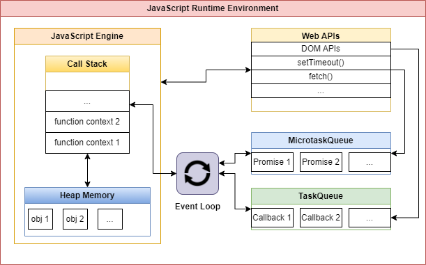

# 🔖 ITI - D0011 - CST (JavaScript 6, ECMA6, ECMA.NEXT) (Part 3)

## Asynchronous

- JS runs on **single thread**

```js
function myfun() {
  let x;
  setTimeout(function () {
    x = 10;
  });
  return x;
}

let result = myfun();
console.log(result); // undefined
```

### Callback

- A *callback* is a function passed as an argument to another function. This technique allows a function to call another function.

#### Callback Hell

Callback hell refers to the situation in JavaScript where multiple nested callbacks create complex, deeply indented code, often called the “pyramid of doom.” This structure makes the code difficult to read, debug, and maintain, resulting in poor code quality and scalability issues.

## JS Runtime Environment



> [!Note]
>
> Also MicrotaskQueue, will also contain `MutationObserver's callback`.

> [!Note]
>
> **Starvation**
>
> **Imagine this:** if micro tasks keep popping up without allowing other tasks a chance to run, what happens next? Well, in this scenario, the Callback Queue won’t get an opportunity to execute its tasks. This situation is what we call the **starvation** of tasks in the **Callback Queue**.

## JS Engine

- Compiler
- Interpreter
- V8 engine
- Turbofan
- AST

## Promises

Solves **callback hell issue**

### Promises States

- pending
- fulfilled
- rejected

### Promises Methods

- then
- catch
- finally

```js
let checkEven = new Promise((resolve, reject) => {
  let number = 4;
  if (number % 2 === 0) resolve("The number is even!");
  else reject("The number is odd!");
});

checkEven
  .then((message) => console.log(message)) // On success
  .catch((error) => console.error(error)); // On failure
```

more functionality: race, all, first

## async/await

- *async* and *await* make promises easier to write.
- *async* makes a function return a Promise. *await* makes a function wait for a Promise.
- Can't be used at script scope

**Syntax Example:**

```js
async function myFunction() {
  return "Hello";
}
myFunction().then(function (value) {
  myDisplayer(value);
});
```

```js
let value = await promise;
```

## fetch API

- The Fetch API interface allows web browser to make HTTP requests to web servers.
- No need for XMLHttpRequest anymore.

**Example:**

```js
async function getData() {
  const url = "https://example.org/products.json";
  try {
    const response = await fetch(url);
    if (!response.ok) {
      throw new Error(`Response status: ${response.status}`);
    }

    const json = await response.json();
    console.log(json);
  } catch (error) {
    console.error(error.message);
  }
}
```

## Web Storage API

The Web Storage API is a simple syntax for storing and retrieving data in the browser

### Local Storage

- The `localStorage` object provides access to a local storage for a particular Web Site.
- It allows you to store, read, add, modify, and delete data items for that domain.
- The data is stored with no expiration date, and will not be deleted when the browser is closed.
- **Methods:**
  - `setItem`
  - `getItem`

```js
localStorage.setItem("name", "John Doe");
localStorage.getItem("name");
```

## JSON API

- `JSON.stringify(object|array):string`
- `JSON.parse(string):object|array`
