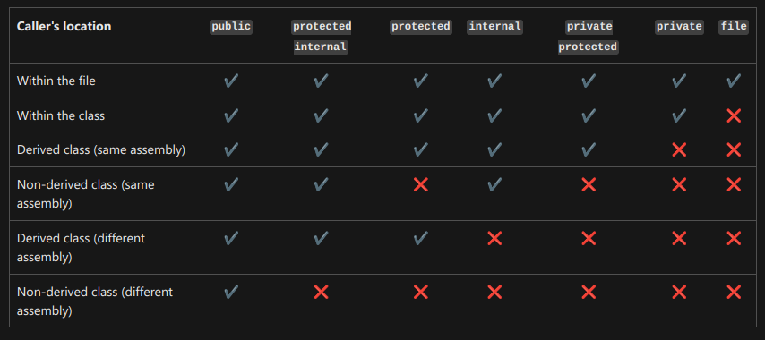

# 🔖 ITI - D0020 - C Sharp - OOP (Part6)

## Abstract Class

- Use `abstract` keyword with
  - Classes
  - Methods
  - Properties (automatic properties)
  - Indexers
- Abstract modifier indicates that thing is defined without implementation

### Key Points: Abstract Class

- Abstract class can't create an explicit object using new
- Abstract class can be inherited, and also inherited from other classes
- Abstract class can contain non-abstract members + abstract members
- Abstract class members can't be declared in non-abstract class

_Example:_

```csharp
abstract class Shape
{
    public abstract int GetArea();
}

class Square : Shape
{
    private int _side;

    public Square(int n)
    {
	    _side = n;
	}

    // GetArea method is required to avoid a compile-time error.
    public override int GetArea()
    {
	    return _side * _side;
	}

    static void Main()
    {
        var sq = new Square(12);
        Console.WriteLine($"Area of the square = {sq.GetArea()}");
    }
}
// Output: Area of the square = 144
```

> [!Note]
> If an abstract class inherits another abstract class, so child class not responsible for implementing inherited abstracted members.

> [!Tip]
>
> **Abstraction** Hide complexity, Show what is necessary

> [!Info]
>
> **Concrete Class**
>
> - Class has implementation for all its methods
> - Class can create object from it
> - Class can be inherited by other classes

## `static` Class & `static` Class Members

- Class members can be an **instance** member or a **type** member
- Static members called **type** members

### Key Points: Static Methods

- Static methods callable by type itself.
- Static members is type scope not an instance scope
- Instance Methods can call static methods but not vice versa
- Static Methods can call other static methods

### Key Points: Static Class

- Static class can't be instantiated
- Static class can't contain instance members
- Static class can contain only static members
- Static class can't be inherited
- Static class can't contain instance constructors

> [!Note]
> C# doesn't support static structs
> Structs support static constructor, static members

### Key Points: Static Constructor

- Static constructor called only once (with the first interaction with the class)
- Static constructor called before any instance constructor
- Static constructor called before any static method
- Static constructor is used to initialize static members
- Static constructor can't have access modifiers
- Static constructor is a parameterless constructor

> [!Note]
>
> - You can create static members inside a concrete class
> - You can't create static constructor inside a concrete class

> [!Note]
> We didn't have static destructor in C#

### key Points: Constants

- Constants are static by default (implicitly)
- Constants values can't be changed

_Example:_

```csharp
public static class TemperatureConverter
{
    public static double CelsiusToFahrenheit(string temperatureCelsius)
    {
        // Convert argument to double for calculations.
        double celsius = Double.Parse(temperatureCelsius);

        // Convert Celsius to Fahrenheit.
        double fahrenheit = (celsius * 9 / 5) + 32;

        return fahrenheit;
    }

    public static double FahrenheitToCelsius(string temperatureFahrenheit)
    {
        // Convert argument to double for calculations.
        double fahrenheit = Double.Parse(temperatureFahrenheit);

        // Convert Fahrenheit to Celsius.
        double celsius = (fahrenheit - 32) * 5 / 9;

        return celsius;
    }
}

class TestTemperatureConverter
{
    static void Main()
    {
        Console.WriteLine("Please select the convertor direction");
        Console.WriteLine("1. From Celsius to Fahrenheit.");
        Console.WriteLine("2. From Fahrenheit to Celsius.");
        Console.Write(":");

        string? selection = Console.ReadLine();
        double F, C = 0;

        switch (selection)
        {
            case "1":
                Console.Write("Please enter the Celsius temperature: ");
                F = TemperatureConverter.CelsiusToFahrenheit(Console.ReadLine() ?? "0");
                Console.WriteLine("Temperature in Fahrenheit: {0:F2}", F);
                break;

            case "2":
                Console.Write("Please enter the Fahrenheit temperature: ");
                C = TemperatureConverter.FahrenheitToCelsius(Console.ReadLine() ?? "0");
                Console.WriteLine("Temperature in Celsius: {0:F2}", C);
                break;

            default:
                Console.WriteLine("Please select a convertor.");
                break;
        }

        // Keep the console window open in debug mode.
        Console.WriteLine("Press any key to exit.");
        Console.ReadKey();
    }
}
/* Example Output:
    Please select the convertor direction
    1. From Celsius to Fahrenheit.
    2. From Fahrenheit to Celsius.
    :2
    Please enter the Fahrenheit temperature: 20
    Temperature in Celsius: -6.67
    Press any key to exit.
 */
```

## Operator Overloading

- A user-defined type can overload operators, and provide customer implementations for them
- Operator types:
  - **Overloadable operators**
    - `+x, -x, !x, ~x, ++, --, true, false`: must be overloaded in pairs
    - `x + y, x - y, x \* y, x / y, x % y, x & y, x | y, x ^ y, x << y, x >> y, x >>> y`
    - `x == y, x != y, x < y, x > y, x <= y, x >= y`: must be overloaded in pairs as follows: `==` and `!=`, `<` and `>`, `<=` and `>=`.
  - **Non-overloadable operators**
    - `new`
    - `&&`
    - `||`
    - `[]`

```csharp
public readonly struct Fraction
{
    private readonly int num;
    private readonly int den;

    public Fraction(int numerator, int denominator)
    {
        if (denominator == 0)
        {
            throw new ArgumentException("Denominator cannot be zero.");
        }
        num = numerator;
        den = denominator;
    }

    public static Fraction operator +(Fraction a) => a;
    public static Fraction operator -(Fraction a) => new Fraction(-a.num, a.den);

    public static Fraction operator +(Fraction a, Fraction b)
        => new Fraction(a.num * b.den + b.num * a.den, a.den * b.den);

    public static Fraction operator -(Fraction a, Fraction b)
        => a + (-b);

    public static Fraction operator *(Fraction a, Fraction b)
        => new Fraction(a.num * b.num, a.den * b.den);

    public static Fraction operator /(Fraction a, Fraction b)
    {
        if (b.num == 0)
        {
            throw new DivideByZeroException();
        }
        return new Fraction(a.num * b.den, a.den * b.num);
    }

    public override string ToString() => $"{num} / {den}";
}

public static class OperatorOverloading
{
    public static void Main()
    {
        var a = new Fraction(5, 4);
        var b = new Fraction(1, 2);
        Console.WriteLine(-a);   // output: -5 / 4
        Console.WriteLine(a + b);  // output: 14 / 8
        Console.WriteLine(a - b);  // output: 6 / 8
        Console.WriteLine(a * b);  // output: 5 / 8
        Console.WriteLine(a / b);  // output: 10 / 4
    }
}
```

## Access Modifiers

- **`public`**: accessible anywhere
- **`private`**: accessible only inside type
- **`protected`**: with inheritance
- **`internal`**: within assembly : within project
- **`internal protected`**



> [!Note]
>
> - Access modifiers for classes, structs, and interfaces:
>   - `public`
>   - `internal`
> - By default, classes, structs, and interfaces are `internal`
> - Class and struct members can have anyone from the all access modifiers, but struct members can't be protected
> - Class members by default are `private`
> - Interface members by default are `public`
