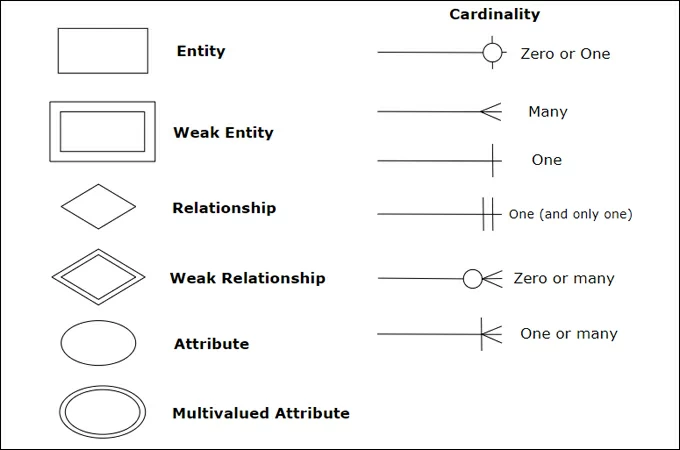
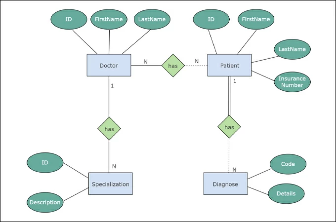

# 🔖 ITI - D0029 - Database

## Database Life Cycle

- **Analysis**: Understand the requirements of the database (by System Analyst).
- **Design**: Design the database (by Database Designer).
- **Mapping**: Map the database design to the physical database schema (Tables, Relations, ...) (by Database Designer).
- **Implementation**: Implement the database on the DBMS (by Database Developer).
- **Application (Operation)**: Build the application (by Application Developer).
- **Maintenance**: Maintain the database including backup and recovery (by Database Administrator).

## File Based System

- **Incompatible File Formats**: File formats are not compatible.
- **Program Data Dependence**: Data is dependent on the application.
- **Limited Data Sharing**: Data sharing is limited.
- **Data Redundancy**: Same data is stored in multiple files.
- **Data Inconsistency**: Data is not consistent across files.
- **Data Isolation**: Data is isolated in files.
- **Security**: Security is not good.
- **Data Integrity**: Data integrity is not maintained.
- **Lengthy Development Time**: Development time is more.

## Database Basic Definitions

- **Database**: A collection of related data.
- **Database Management System (DBMS)**: A software system that enables users to define, create, maintain and control access to the database.
- **Database System**: The DBMS software together with the data itself.

## Benefits of Database System

- **Standardization**: Standard format for data and data access.
- **Data Sharing**: Data can be shared among multiple users.
- **Data Integrity**: Data integrity is maintained.
- **Data Security**: Data security is good, only authorized users can access the data.
- **Data Independence**: Data is independent of the application, data can be accessed by multiple applications without caring about the underlying data storage.
- **Backup and Recovery**: Backup and recovery is easy.

## Database Users

- Database Administrator (DBA)
- System Analyst
- Database Designer
- Database Developer
- Application Developer
- BI & Big Data Specialist (Data Scientist)
- End Users

## Entity-Relationship Model (ER Model)

- **ERD**: Entity-Relationship Diagram is a graphical representation of entities and their relationships.
- **Entity**: An object that exists and important to store data about it. (probably is a `noun` in the requirements)
- **Attributes**: Properties of entities.
- **Relationship**: Describes how entities are related to each other (probably is a `verb` in the requirements).

### Entity Types

- **Strong Entity**: Not depend on other entity.
- **Week Entity**: Depend on other entity(strong-entity).

### Attribute Types

- **Simple Attribute**: Cannot be divided.
- **Composite Attribute**: Can be divided into smaller sub-parts.
- **Derived Attribute**: Derived from other attributes.
- **Multi-valued Attribute**: Can have multiple values.
- **Complex Attribute**: Composite and Multi-valued attributes.

### Relationship

Relationship has 3 properties:

- **Degree**: Number of entities participating in the relationship.
  - **Unary Relationship**: Relationship between the same entity.
    - **Recursive Relationship**: Relationship between the entity and itself.
  - **Binary Relationship**: Relationship between two entities.
  - **Ternary Relationship**: Relationship between three entities.
- **Cardinality**: Number of instances of an entity that can be associated with the relationship.
  - **One-to-One (1:1)**: One instance of an entity is associated with one instance of another entity.
  - **One-to-Many (1:M)**: One instance of an entity is associated with many instances of another entity.
  - **Many-to-Many (M:N)**: Many instances of an entity are associated with many instances of another entity.
- **Participation**: Describes whether the existence of an entity depends on the relationship.
  - **Total Participation**: Every entity must participate in the relationship (most probably represented with `must` in the requirement document).
  - **Partial Participation**: Not every entity must participate in the relationship (most probably represented with `may` in the requirement document).

> [!Tip]
>
> A **Weak Entity** must have Total Participation with the **Strong Entity** it depends on. This means every record in the weak entity must be associated with a record in the strong entity.

### ER Model Symbols

**Example: Using ERD**:

## Types of Keys

1. **Candidate Key**: is a set of one or more attributes whose value can uniquely identify an entity in the entity set.
2. **Primary Key**: The **chosen candidate key** used to uniquely identify each record in a table. It **cannot contain null values** and must be **unique**.
3. **Foreign Key**: An attribute (or set of attributes) in one table that **refers to the primary** key in another table. It establishes a **relationship** between two tables.
4. **Composite Key**: A **combination of two or more attributes** that uniquely identify a record when used together. Each attribute alone is not unique.
5. **Partial Key**: A key used in **weak entities** to uniquely identify records when combined with the foreign key from the strong entity it depends on.
6. **Alternate Key**: All **candidate keys** that are **not chosen as the primary key**. They are still unique and can be used to identify records.
7. **Super Key**: A set of one or more attributes that can **uniquely identify** a record, but it may include extra attributes that are not necessary for uniqueness.
