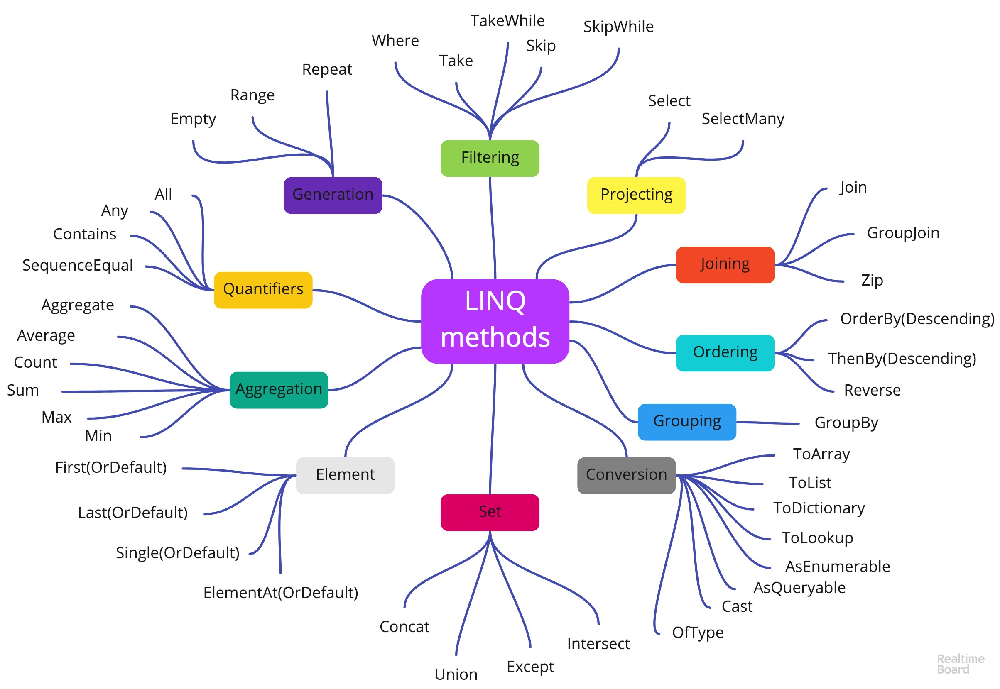

# 🔖 ITI - D0038 - LINQ

## Introduction

- **LINQ** stands for **Language Integrated Query**.
- It provides a consistent model for working with data across various kinds of data sources and formats.
- LINQ works on collections that implement the `IEnumerable<T>` interface.
- It relies on some key features of C#, such as:
  - **Extension methods**: These methods are used to add new methods to existing types without modifying the original type.
  - **var keyword** (Implicit Typed Local Variables): This keyword allows the compiler to infer the type of a variable.
  - **Delegates & Anonymous methods**: These are used to pass methods as parameters to other methods.
  - **Anonymous types**: These are used to create objects without defining a class.

## Anonymous Types

- Anonymous types let you create objects without defining a class or type beforehand.
- Useful when you need to group some data temporarily and don’t want to create a new class.
- The compiler automatically creates a type behind the scenes based on the properties you define.
- All objects created using the same anonymous type will have the same structure (same properties, order, and types).

**Syntax:**

```csharp
var [variable_name] = new { [property1], [property2], ... };
```

**Example:**

```csharp
var obj = new { Id = 100, Name = "John Doe" };
Console.WriteLine(obj); // Output: { Id = 100, Name = John Doe }
Console.WriteLine(obj.GetType()); // Output: <>f__AnonymousType0`2[System.Int32,System.String]
```

## Defer Execution and Eager Execution

### Defer Execution

- Queries are not executed immediately when they are written.
- They are executed only when the results are actually needed (e.g., when you iterate over the results).
- Useful for optimizing performance because the query is only run when necessary.
  **Example**:

```csharp
var query = students.Where(s => s.Age > 20); // Query is not executed here
foreach (var student in query) { } // Query is executed here
```

### Eager Execution

- Queries are executed immediately when they are written.
- The results are stored in memory as soon as the query is run.
- Useful when you need to use the results multiple times without re-executing the query.
  **Example**:

```csharp
var result = students.Where(s => s.Age > 20).ToList(); // Query is executed here
```

## 2 Ways of Using LINQ

### Method Syntax (Fluent Syntax)

- Uses methods like `Where()`, `Select()`, `OrderBy()`, etc.
- Looks more like regular C# code.
- Supports method chaining.
  **Example**:

```csharp
var result = students.Where(s => s.Age > 20).Select(s => s.Name);
```

### Query Syntax

- Looks more like SQL-style queries.
- Uses keywords like `from`, `where`, `select`, `orderby`, etc.
  **Example**:

```csharp
var result = from s in students
             where s.Age > 20
             select s.Name;
```

### 🌟 Hybrid Syntax

- You can mix both method and query syntax.
- Useful when you want to use the best of both ways.

**Example**:

```csharp
var result = (from s in students
              where s.Age > 20
              select s.Name).ToList();

var result = students.Where(s => s.Age > 20).Select(s => s.Name).FirstOrDefault();
```

## LINQ Operators



← Prev | [🏠 Index](../../README.md#index) | [Next →](./iti-d0039-ef.md)
