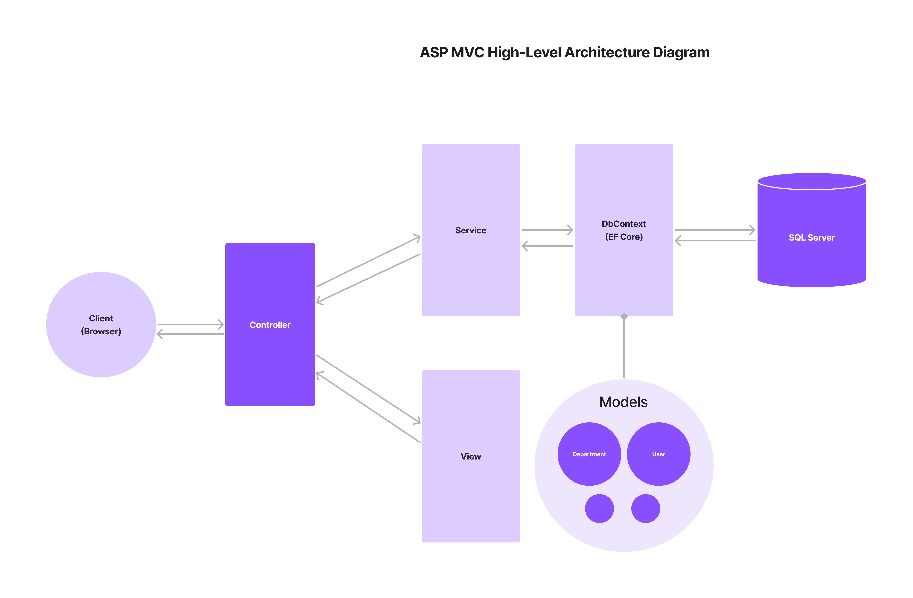

# 🔖 ITI - D0043 - ASP .NET MVC

## Modularize MVC Application Into Layers

- **Model**: Represents the data and the business logic of the application.
- **View**: Represents the user interface of the application.
- **Controller**: Acts as an intermediary between Model and View.
- **Service Layer**: Contains the business logic of the application and interacts with the Model (DbContext In-case of Entity Framework).



### Advantages of Modularizing MVC Application Into Layers

- **Separation of Concerns**: Each layer has a specific responsibility.
- **Reusability**: Each layer can be reused in other applications.
- **Testability**: Each layer can be tested independently.
- **Maintainability**: Each layer can be maintained independently.

## Dependency Injection

- **Dependency Injection (DI)** is a design pattern that allows us to develop loosely coupled code.
- **DI** is a technique where one object supplies the dependencies of another object.
- **DI** is a way to achieve Inversion of Control (IoC).
- **IoC** is a design principle where the control of object creation and lifecycle is inverted to a container or framework.

## How to Apply DI in ASP .NET MVC

1. We should create an interface for the service class, to make it loosely coupled with the controller.
2. We should register the service class and its interface in the `Program.cs` file.
3. We should inject the service class into the controller constructor.

```csharp
// IService.cs
public interface IService
{
    void DoSomething();
}

// Service.cs
public class Service : IService
{
    public void DoSomething()
    {
        // Implementation
    }
}

// Controller.cs
public class Controller : Controller
{
    private readonly IService _service;

    public Controller(IService service)
    {
        _service = service;
    }

    public IActionResult Index()
    {
        _service.DoSomething();
        return View();
    }
}

// Program.cs
public class Program
{
    public static void Main(string[] args)
    {
        CreateHostBuilder(args).Build().Run();
    }

    public static IHostBuilder CreateHostBuilder(string[] args) =>
        Host.CreateDefaultBuilder(args)
            .ConfigureWebHostDefaults(webBuilder =>
            {
                webBuilder.UseStartup<Startup>();
            })
            .ConfigureServices(services =>
            {
                services.AddTransient<IService, Service>();
            });
}
```

### Different Ways to Register Services in ASP .NET Core

1. **Transient**: A new instance is created every time the service is requested.
2. **Scoped**: A new instance is created once per request.
3. **Singleton**: A single instance is created for the lifetime of the application.

### Registering DbContext in ASP .NET Core

```csharp
public void ConfigureServices(IServiceCollection services)
{
    services.AddDbContext<ApplicationDbContext>(options =>
        options.UseSqlServer(builder.Configuration.GetConnectionString("DefaultConnection")));
}
```

We should at first add connection string in `appsettings.json` file.

```json
{
  "ConnectionStrings": {
    "DefaultConnection": "Server=(localdb)\\mssqllocaldb;Database=MyDatabase;Trusted_Connection=True;"
  }
}
```

### DI in Different Layers

- **Controller**: Injects the service class.
- **Service Layer**: Injects the DbContext.

### DI in Different Places

- **Constructor Injection**: Injects the dependencies through the constructor.

```csharp
public class Controller : Controller
{
    private readonly IService _service;

    public Controller(IService service)
    {
        _service = service;
    }
}
```

- **Method Injection**: Injects the dependencies through the method.

```csharp
public class Controller : Controller
{
    private readonly IService _service;

    public IActionResult Index([FromServices] IService service)
    {
        service.DoSomething();
        return View();
    }
}
```

- **Property Injection**: Injects the dependencies through the property.

```csharp
public class Controller : Controller
{
    [FromServices]
    public IService Service { get; set; }

    public IActionResult Index()
    {
        Service.DoSomething();
        return View();
    }
}
```

### Use cases of Different DI Registrations

- **Transient**: Lightweight, stateless, reusable logic (e.g., validation, EmailService).
- **Scoped**: Stateful(state per request), Request-specific logic (e.g., DbContext, UnitOfWork, BusinessService).
- **Singleton**: Heavyweight, stateful(shared state), shared logic (e.g., Configuration, Cache, Logger).
