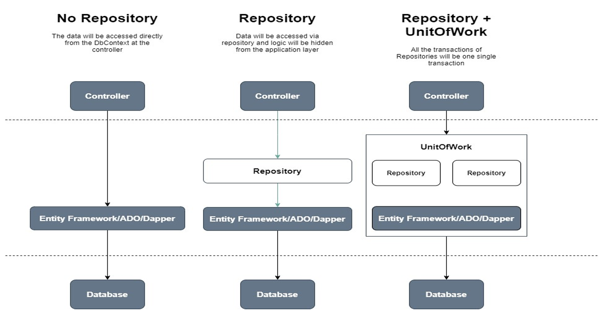

# 🔖 ITI - D0049 - ASP .NET API

## Design Patterns vs. Architecture Patterns

### Design Patterns

- **Scale**: Small-Scale, Code-Level(Using methods and classes).
- **Focuses**: Solve common coding problems.
- **Example**: Singleton, Factory and Observer, etc.
- **UseCase**: Helps to organize code and improve reusability.

### Architecture Patterns

- **Scale**: Big-Picture, System-Level Solutions.
- **Focuses**: Solve common architectural problems and How system components communicate.
- **Example**: MVC, MVVM, etc.
- **UseCase**: Defines how an application is built and scales.

## Dependency Injection vs. Dependency Inversion

### Dependency Injection

- **Focuses**: How objects obtain their dependencies.
- **Example**: Constructor Injection, Property Injection, Method Injection.
- **UseCase**: Helps to decouple classes and improve testability.
- Uses with IoC Containers, which manages object creation and life-cycle.

### Dependency Inversion

- **Focuses**: High-Level modules should not depend on low-level modules. Both should depend on abstractions.
- **Example**: Interfaces, Abstract Classes.
- **UseCase**: Helps to decouple high-level and low-level modules.
- Inversion of Control (IoC) is a design principle that helps to invert the flow of control.

### How IoC, DI and DIP are working together in ASP .NET Core?

- **IoC (Inversion of Control) Container**: Manages object creation and life-cycle, instead of creating object manually, we delegate this to IoC Container.
- **DI (Dependency Injection)**: Helps to decouple classes and improve testability.
- **DIP (Dependency Inversion Principle)**: High-Level modules should not depend on low-level modules. Both should depend on abstractions.

**Example**:

```csharp
// IAccountsService.cs
public interface IAccountsService
{
    Task<User> RegisterAsync(RegisterRequest request);
}

// AccountsService.cs
public class AccountsService : IAccountsService
{
    public async Task<User> RegisterAsync(RegisterRequest request)
    {
        // Register User
    }
}

// Program.cs
builder.Services.AddScoped<IAccountsService, AccountsService>(); // Register Service

// AccountsController.cs
public class AccountsController : ControllerBase
{
    private readonly IAccountsService _accountsService;

    public AccountsController(IAccountsService accountsService)
    {
        _accountsService = accountsService;
    }

    [HttpPost("register")]
    public async Task<IActionResult> RegisterAsync(RegisterRequest request)
    {
        var user = await _accountsService.RegisterAsync(request);
        return Ok(user);
    }
}
```

## Repository Pattern

- **Focuses**: Separation of Concerns, Decouples data access logic in a separate layer.
- **Benefits**: Helps to centralize data logic and improve testability.

**Example**:

```csharp
// IUserRepository.cs
public interface IUserRepository
{
    Task<User> GetByIdAsync(int id);
    Task<User> GetByEmailAsync(string email);
    // ... other methods like Create, Update, Delete, etc.
}

// UserRepository.cs
public class UserRepository : IUserRepository
{
    public async Task<User> GetByIdAsync(int id)
    {
        // Get User by Id
    }

    public async Task<User> GetByEmailAsync(string email)
    {
        // Get User by Email
    }
}

// Program.cs
builder.Services.AddScoped<IUserRepository, UserRepository>(); // Register Repository
```

## Generic Repository Pattern

- **Focuses**: Same as Repository Pattern but with Generic Type for reusability.
- **Benefits**: Helps to avoid code duplication and improve maintainability.

**Example**:

```csharp
// IRepositoryBase.cs
public interface IRepositoryBase<T> where T : class
{
    Task<List<T>> GetAllAsync();
    Task<T> GetByIdAsync(int id);
    // ... other methods like Create, Update, Delete, etc.
}

// RepositoryBase.cs
public class RepositoryBase<T> : IRepositoryBase<T> where T : class
{
    public async Task<List<T>> GetAllAsync()
    {
        // Get All
    }

    public async Task<T> GetByIdAsync(int id)
    {
        // Get by Id
    }
}

// Program.cs
builder.Services.AddScoped<IRepositoryBase<User>, RepositoryBase<User>>(); // Register Repository
builder.Services.AddScoped<IRepositoryBase<Product>, RepositoryBase<Product>>(); // Register Repository
```

**🌟 Register all Repositories in a single line:**

```cs
builder.Services.AddScoped(typeof(IRepositoryBase<>), typeof(RepositoryBase<>)); // Register Generic Repository
```

## Unit of Work Pattern

- **Focuses**: Helps to maintain data consistency and transaction management.
- **Benefits**:
  - Ensures that all operations are performed on a single database context.
  - Wrap multiple dependencies in a single object (Unit of Work).



**Example**:

```csharp
// IRepositoryBase.cs
public interface IRepositoryBase<T> where T : class
{
    Task<List<T>> GetAllAsync();
    Task<T> GetByIdAsync(int id);
    // ... other methods like Create, Update, Delete, etc.
}

// IUnitOfWork.cs
public interface IUnitOfWork
{
    IRepositoryBase<User> Users { get; }
    IRepositoryBase<Product> Products { get; }
    // ... other repositories
    Task SaveAsync();
}

// UnitOfWork.cs
public class UnitOfWork : IUnitOfWork
{
    private readonly AppDbContext _context;
    public IRepositoryBase<User> Users { get; }
    public IRepositoryBase<Product> Products { get; }
    // ... other repositories

    public UnitOfWork(AppDbContext context)
    {
        _context = context;
        Users = new RepositoryBase<User>(_context);
        Products = new RepositoryBase<Product>(_context);
        // ... other repositories
    }

    public async Task SaveAsync()
    {
        await _context.SaveChangesAsync();
    }
}

// Controller.cs
public class UsersController : ControllerBase
{
    private readonly IUnitOfWork _unitOfWork;

    public UsersController(IUnitOfWork unitOfWork)
    {
        _unitOfWork = unitOfWork;
    }

    [HttpGet]
    public async Task<IActionResult> GetUsersAsync()
    {
        var users = await _unitOfWork.Users.GetAllAsync();
        return Ok(users);
    }
}

// Program.cs
builder.Services.AddScoped<IUnitOfWork, UnitOfWork>(); // Register Unit of Work
```

### Unit of Work with Lazy Repository Initialization

```csharp
// ProductsUnitOfWork.cs
public interface IProductsUnitOfWork
{
    IRepositoryBase<Product> ProductsRepo { get; }
    IRepositoryBase<Category> CategoriesRepo { get; }
    Task SaveAsync();
}

public class ProductsUnitOfWork : IProductsUnitOfWork
{
    private readonly AppDbContext _context;
    private IRepositoryBase<Product> _productsRepo;
    private IRepositoryBase<Category> _categoriesRepo;

    public ProductsUnitOfWork(AppDbContext context)
    {
        _context = context;
    }

    public IRepositoryBase<Product> ProductsRepo
    {
        get
        {
            if (_productsRepo == null)
            {
                _productsRepo = new RepositoryBase<Product>(_context);
            }
            return _productsRepo;
        }
    }

    public IRepositoryBase<Category> CategoriesRepo
    {
        get
        {
            if (_categoriesRepo == null)
            {
                _categoriesRepo = new RepositoryBase<Category>(_context);
            }
            return _categoriesRepo;
        }
    }

    public async Task SaveAsync()
    {
        await _context.SaveChangesAsync();
    }
}
```

### 🌟 Single Generic Unit of Work with Lazy Repository Initialization

```csharp
// IUnitOfWork.cs
public interface IUnitOfWork
{
    public IRepository<TEntity> Repository<TEntity>() where TEntity : class;
    public Task SaveChangesAsync();
}

// UnitOfWork.cs
public class UnitOfWork : IUnitOfWork
{
    private readonly AppDbContext _context;
    private Dictionary<Type, object> _repositories; // (EntityType, RepoInstance)

    public UnitOfWork(AppDbContext context)
    {
        _context = context;
    }

    public IRepository<TEntity> Repository<TEntity>() where TEntity : class
    {
        var type = typeof(TEntity);

        if (_repositories == null)
        {
            _repositories = new Dictionary<Type, object>();
        }

        if (!_repositories.ContainsKey(type))
        {
            var repositoryType = typeof(RepositoryBase<>).MakeGenericType(type);

            var repositoryInstance = Activator.CreateInstance(
                repositoryType,
                _context);

            _repositories.Add(type, repositoryInstance);
        }

        return (IRepository<TEntity>)_repositories[type];
    }

    public async Task SaveChangesAsync()
    {
        await _context.SaveChangesAsync();
    }
}
```

## Enhance Generated OpenAPI Documentation By Using Attributes (Decorators)

- `[EndpointDescription]`: Provides a detailed description of an endpoint.

  ```csharp
  [EndpointDescription("Gets a list of all products.")]
  [HttpGet("products")]
  public IActionResult GetProducts() => Ok();
  ```

- `[EndpointSummary]`: Gives a short summary of the endpoint.

  ```csharp
  [EndpointSummary("Fetch all products.")]
  [HttpGet("products")]
  public IActionResult GetProducts() => Ok();
  ```

- `[ProduceResponseType]`: Defines the response type and HTTP status code.

  ```csharp
  [ProducesResponseType(typeof(List<Product>), 200)]
  [ProducesResponseType(404)]
  [HttpGet("products")]
  public IActionResult GetProducts() => Ok();
  ```

- `[Produces]`: Specifies the response content type (e.g., JSON, XML).

  ```csharp
  [Produces("application/json")]
  [HttpGet("products")]
  public IActionResult GetProducts() => Ok();
  ```

- `[Consumes]`: Defines the expected request content type (e.g., JSON, XML).

  ```csharp
  [Consumes("application/json")]
  [HttpPost("products")]
  public IActionResult CreateProduct([FromBody] Product product) => Ok();
  ```

[← Prev](./iti-d0048-asp-mvc.md) | [🏠 Index](../../README.md#index) | Next →
